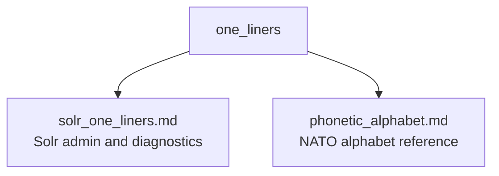

# One Liners

Cheat sheets of one-liners and helpful snippets I reach for regularly, collected from years of operating search clusters.

## Contents

| File | What's inside |
|------|---------------|
| [solr_one_liners.md](solr_one_liners.md) | Solr administration and diagnostic commands |
| [phonetic_alphabet.md](phonetic_alphabet.md) | NATO phonetic alphabet, for reading cluster names over the phone |

## License

MIT. See [LICENSE](LICENSE).
